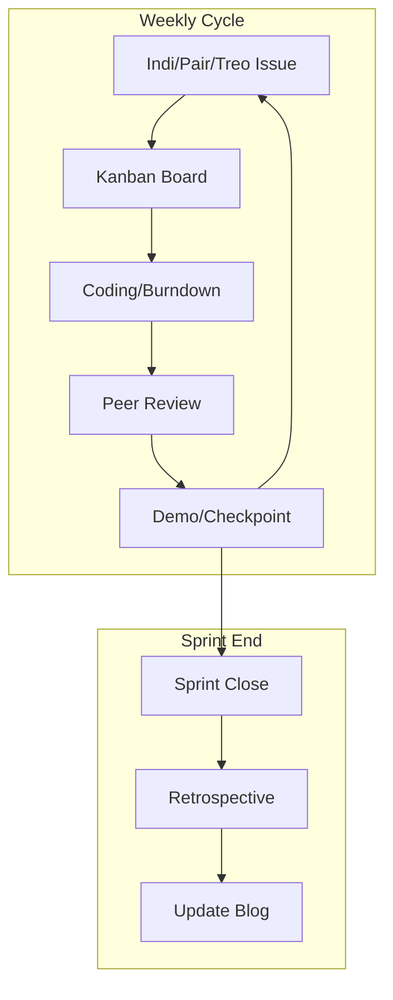
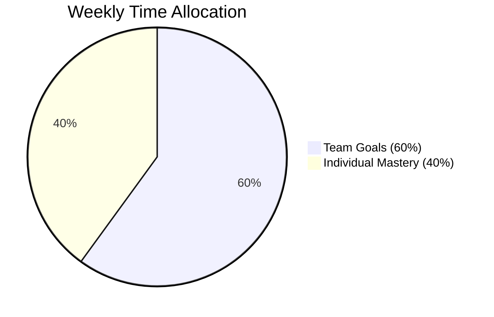

## Intro

Teacher and peer evaluation are critical to our success and improvement.

Be sure to support each objective by performing self-reviews, providing feedback to peers, and acting on the feedback received from teachers and peers. The best way to support dialogue in our environment is to provide a Review Ticket (GitHub Issues and/or GitHub Pages Utterance).

1. **Individual Issues:**
   - You are required to build an issue and/or blog that describes your personal journey in all sprints.
   - By the end of this sprint, you should have personal issues/blogs related to Sprint 1 and .

2. **Team Issue(s):**
   - To collaborate effectively, there should be issue(s) assigned to you from the team.
   - These issues should show progression from ideation, development, prototype development, integration development (pull request), and how you validated tests with the team.

3. **Preparation:**
   - It is best to go through the checklists below.
   - The teacher will want you to summarize information effectively.
   - A significant part of your success will depend on how you present and self-evaluate.



### Checkpoint Evaluation

This section outlines the criteria and guidelines for each weekly evaluation of your trimester work. The evaluation is divided into two main categories: Team Evaluation and Individual Mastery. Each category has specific items that will be graded based on the provided guidelines.

#### Grading Guideline
- **55%**: Minimum per item
- **75%**: Effort shown
- **85%**: Complete
- **90%**: Mastery

#### Weekly Evaluation Process
Each week, points are awarded for team and individual accomplishments. To calculate your weekly score:

- Add up the points earned for the week.
- Multiply the total by 2.
- Divide by 10 to get your weekly fraction of a point.

This process allows you to accumulate points over time, with each week contributing a fraction toward your overall grade.  In later weeks we can increase the multiplyer.

#### Team Evaluation

| **Assignment**                  | **Points**    | **Grade** | **Evidence** |
|---------------------------------|---------------|-----------|--------------|
|  Team Checkpoint        | 1             |           |              |
|  Team Issue(s)/Plan FE  | 1             |           |              |
|  Team Issue(s)/Plan BE  | 1             |           |              |
| **Total**                       | 3             |           |              |

#### Team Raw Form

```text
| **Assignment**                  | **Points**    | **Grade** | **Evidence** |
|---------------------------------|---------------|-----------|--------------|
|  Team Checkpoint        | 1             |           |              |
|  Team Issue(s)/Plan FE  | 1             |           |              |
|  Team Issue(s)/Plan BE  | 1             |           |              |
| **Total**                       | 3             |           |              |
```

#### Individual Mastery 

| **Assignment**                  | **Points**    | **Grade** | **Evidence** |
|---------------------------------|---------------|-----------|--------------|
| Technical Mastery               | 1             |           |              |
| Soft Skills                     | 1             |           |              |
| **Total**                       | 2             |           |              |

#### Individual Raw Form

```text
| **Assignment**                  | **Points**    | **Grade** | **Evidence** |
|---------------------------------|---------------|-----------|--------------|
| Technical Mastery               | 1             |           |              |
| Soft Skills                     | 1             |           |              |
| **Total**                       | 2             |           |              |
```

### Checkpoint Review Ticket

Show your teacher that you have chronicled your accomplishments for each checkpoint.

- **Sixty:** Each individual should spend 60% of their time toward team goals.
- **Forty:** Each individual should spend 40% of their time toward individual mastery.



#### Team Checkpoints

Teams should show progress each week in a live checkpoint review. It is encouraged to seek an early opportunity to review team progress.

- Demos are a great way to show team progress.
  - Design demos can be shown with design documentation or Jupyter Notebooks.
  - Frontend (FE) demos should be shown using Inspect, before and after integration.
  - Backend (BE) demos should be shown using Postman, before and after integration.
  - Full Stack demos are always nice, but are not always required to show incremental progress.
- Burndown lists are a great way to show progress within an issue.
- Kanban boards are a great way to show progress for groups of issues.

#### Individual Mastery

During checkpoints, students should relate their work to individual mastery.

1. **Code Mastery**
   - Code reviews are a great way to show individual progress.
   - Individual key commits are a great way to highlight accomplishments.
   - Analytics can complement code participation.
   - Show your ability to work in the programming languages you have learned.
   - Include code samples or project snippets that highlight your skills.

2. **Team Teaching Knowledge**
   - Participating in teaching lessons will be part of your individual mastery.
   - Talking about code in teaching highlights your individual knowledge.
   - Participating in grading and giving quality feedback is an excellent way to demonstrate knowledge.
   - Explaining how your team project aligns with College Board requirements shows depth of understanding.
   - Providing specific examples from your project in lessons shows your ability to analyze AP standards.

3. **Tools and Framework Mastery**
   - Demonstrate your proficiency with debugging and fixing issues to show progress as a developer.
   - Provide examples of how you have utilized various panels in the browser; using Inspect demonstrates knowledge.
   - Building test cases in Postman to validate backend APIs shows growth in understanding the SDLC (Software Development Life Cycle).
   - Showing your ability to research or incorporate third-party tools demonstrates mastery.
   - Building backend UIs for administrative tasks, backing up, and restoring data shows depth of understanding.
