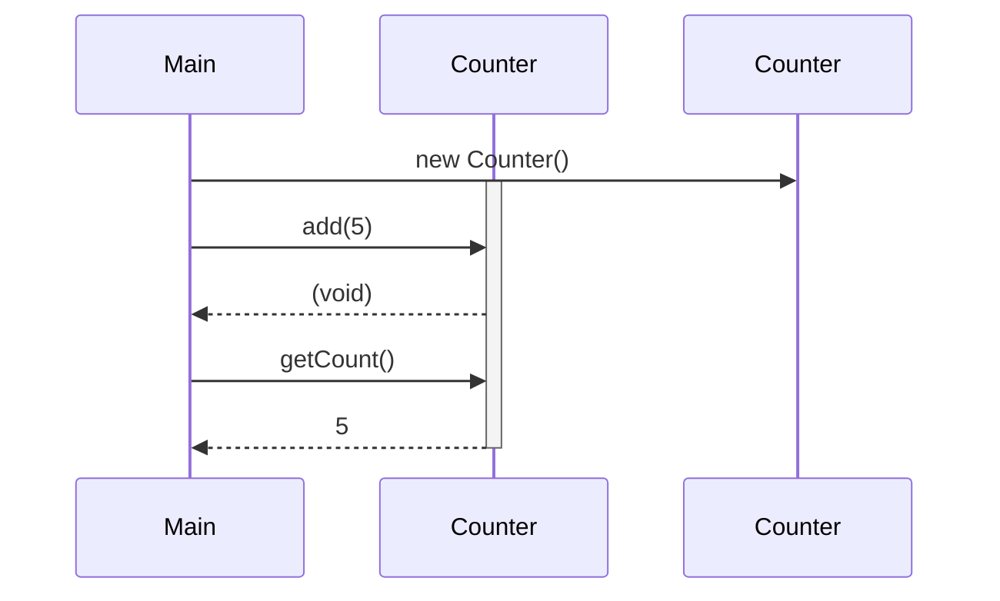

## Overview of Classes, Objects and Methods: A Cookie Analogy

Class = blueprint

- A class is like a recipe. A `Cookie` recipe says what ingredients exist and what steps to follow

Object = Thing made from blueprint

- Each cookie baked with `new Cookie(...)` is its own entity with its own chocolate chips

Method = Action

- Methods are the verbs associated with the object/things the object can do (i.e. `breakInHalf()`, `burn`, or `melt`)
- A static/class method belongs to the blueprint, not one cookie (i.e. `Cookie.getOvenTemperature()` does not depend on any particular cookie. It is true for all cookies)

## What is an instance method?

An **instance method** is a method (function) defined in a class that operates on a particular instance (object) of that class.

- It can access that object’s instance variables (its state) and perform actions using or modifying them.
- To use an instance method, you first need an object (an instance), then you call the method via that object.

Continuing with the cookie analogy:

**Instance Method:** action specific cookie can do

- It needs a particular cookie to run (because it uses that cookie’s data).
- It can read/change that cookie’s fields using `this`.
- You call it on an object, like `myCookie.addChips(3);`

Compared to a static method, which would only include blueprint-level info (i.e. `public static int ovenTempF() { return 350; }` )

## Static/class methods vs. instance methods

| Kind           | Called on         | Can access                  | Typical use                         |
|----------------|-------------------|-----------------------------|-------------------------------------|
| Static/Class method   | the class itself  | only static/class variables | behavior common to all objects       |
| Instance method| a specific object | that object’s instance variables | behavior specific to that one object |


In other words:

| Feature                                   | Instance method                         | Class (`static`) method                         |
|-------------------------------------------|-----------------------------------------|-------------------------------------------------|
| How you call it                           | `myCookie.addChips(2)`                  | `Cookie.ovenTempF()`                            |
| Has a `this`?                             | Yes (`this` = that cookie)              | No (`this` is illegal)                          |
| Can read/change per-object fields?        | Yes                                     | No (unless given an object as a parameter)      |
| Common uses                               | Behaviors tied to one object’s state    | Utilities, factory methods, class-wide info     |
| Inheritance behavior                      | Can be overridden (polymorphism)        | Can’t be overridden (only hidden / shadowed)    |

### Visual: Calling Instance Methods




## Syntax of calling an instance method:


```java
// Suppose we have a class:
public class Dog {
    private String name;
    public Dog(String name) {
        this.name = name;
    }
    public void bark() {
        System.out.println(name + " says: Woof!");
    }
}

// To use it:
Dog d = new Dog("Fido");  // create an instance
d.bark();                 // call the instance method on d
```

    Fido says: Woof!


- `d.bark();` invokes the `bark` method on the object `d`.

Inside `bark`, `this.name` refers to `d`’s /`name`.

## Popcorn Hack #1

- Add another property to the dog class for `breed`.
- Add another method to the dog class that prints "My dog `name` is a `breed`!"
- Create a new object of this class and call the method.


```java
public class Dog {

    // ADD CODE HERE
}

// To use it:
// ADD CODE HERE
```

If the method takes parameters, you provide arguments:

```java
public class Counter {
    private int count;
    public void add(int x) {
        count += x;
    }
    public int getCount() {
        return count;
    }
}

// Use it:
Counter c = new Counter();
c.add(5);
int val = c.getCount();  // returns 5
```

- ```c.add(5);``` — calls method ```add``` on ```c``` with argument ```5```.
- ```c.getCount()```; — calls method that returns an ```int```.

## Popcorn Hack #2

- Add on to the previous counter class and add three more methods for subtraction, multiplication, and division.

- Call all five methods outside of the class.


```java
public class Counter {
    private int count;
    
    // ADD CODE HERE
}

// Use it:
// ADD CODE HERE
```

## Key points & common errors

1. Must have an object reference

- You can’t call an instance method from the class name (unless you have a static context). E.g., ```Dog.bark()```; is invalid (unless ```bark``` is static), because ```bark``` needs a specific object.

2. Return values vs void methods

- A method declared ```void``` doesn’t return anything; you just call it for its side effects (e.g. ```d.bark();```).
- A non-void method returns a value; you can use that value in expressions, assign it to variables, etc. (e.g. ```int x = c.getCount();```).

3. Passing arguments

- If a method requires parameters, you must supply arguments of matching types when calling.

4. Chaining (optional / advanced)

- If a method returns an object (or the same object), you can chain calls. 
- E.g. ```obj.method1().method2();``` but this is only applicable when the return types line up.

## Example: Turtle House

Suppose you have a ```Turtle``` class that can move and draw:

```java
public class Turtle {
    private int x, y;
    public void forward(int distance) {
        // move the turtle forward by distance
    }
    public void turnLeft(int degrees) {
        // rotate turtle direction
    }
    public void drawHouse() {
        // uses forward and turnLeft to draw a house
        forward(50);
        turnLeft(90);
        forward(50);
        // etc.
    }
}
```

You might use it like:

```java
Turtle t = new Turtle();
t.drawHouse();   // high-level call, internally calls forward, turnLeft, etc.
```

Here, ```drawHouse``` is an instance method that, when invoked on ```t```, calls other instance methods (```forward```, ```turnLeft```) on the same object (implicitly ```this.forward(...)```s, etc.).

### Important Rules to Keep in Mind (AP Test-Specific):

1. You must create an object before calling its instance methods. You cannot call an instance method directly on the class name (e.g., ```Dog.bark()``` won't work unless bark is static).
2. The object reference cannot be ```null```. If you try to call an instance method on a null reference, you'll get a ```NullPointerException``` at runtime.
3. Arguments must match parameter types exactly (or be compatible through widening conversion). The number, order, and types of arguments must match the method signature.
4. ```void``` methods don't return values. You cannot assign the result of a ```void``` method to a variable or use it in an expression (e.g., ```int x = d.bark()```; is invalid if ```bark``` is ```void```).
5. Method calls are evaluated left-to-right. When chaining methods (e.g., ```obj.method1().method2()```), Java evaluates from left to right, and each method must return an appropriate object for the next call.
6. Instance methods can call other instance methods of the same class directly (without needing ```this.```), and they implicitly operate on the same object.
7. Parameter names in the method definition don't matter when calling. When you call ```c.add(5)```, the actual argument ```5``` gets passed to whatever the parameter is named in the method definition.


## Bonus Example!

```java
// Define the Joke class
class Joke {
    private String setup;
    private String punchline;

    public Joke(String setup, String punchline) {
        this.setup = setup;
        this.punchline = punchline;
    }

    public void tellJoke() {
        System.out.println(setup);
        System.out.println(punchline);
    }
}

// Create and run a joke
Joke myJoke = new Joke("Why don’t programmers like nature?",
                       "Because it has too many bugs!");

myJoke.tellJoke();
```

## MC Hacks

### Question 1

Consider the following class:
```java
public class BankAccount {
    private double balance;
    
    public BankAccount(double initialBalance) {
        balance = initialBalance;
    }
    
    public void deposit(double amount) {
        balance += amount;
    }
    
    public double getBalance() {
        return balance;
    }
}
```

Which of the following code segments will compile without error:

A)
```java
BankAccount.deposit(50.0);
double total = BankAccount.getBalance();
```

B)
```java
BankAccount account = new BankAccount(100.0);
account.deposit(50.0);
double total = account.getBalance();
```

C)
```java
BankAccount account = new BankAccount(100.0);
double total = account.deposit(50.0);
```

D)
```java
BankAccount account;
account.deposit(50.0);
double total = account.getBalance();
```

E)
```java
double total = getBalance();
BankAccount account = new BankAccount(total);
```

### Question 2

What is printed as a result of executing the following code?

```java
public class Rectangle {
    private int length;
    private int width;
    
    public Rectangle(int l, int w) {
        length = l;
        width = w;
    }
    
    public int getArea() {
        return length * width;
    }
    
    public void scale(int factor) {
        length *= factor;
        width *= factor;
    }
}

Rectangle rect = new Rectangle(3, 4);
rect.scale(2);
System.out.println(rect.getArea());
```

A) 12

B) 24

C) 48

D) 96

E) Nothing is printed; the code does not compile

### Question 3

Which of the following best describes when a `NullPointerException` will occur when calling an instance method?

A) When the method is declared as `void`

B) When the method is called on a reference variable that has not been initialized to an object

C) When the method's parameters do not match the arguments provided

D) When the method is called from outside the class

E) When the method attempts to return a value but is declared as `void`

### Question 4

Which of the following code segments will NOT compile?
```java
public class Temperature {
    private double celsius;
    
    public Temperature(double c) {
        celsius = c;
    }
    
    public double getFahrenheit() {
        return celsius * 9.0 / 5.0 + 32;
    }
    
    public void setCelsius(double c) {
        celsius = c;
    }
}
```

A)
```java
Temperature temp = new Temperature(0);
System.out.println(temp.getFahrenheit());
```

B)
```java
Temperature temp = new Temperature(100);
temp.setCelsius(25);
```

C)
```java
Temperature temp = new Temperature(20);
double f = temp.getFahrenheit();
```

D)
```java
Temperature temp = new Temperature(15);
int result = temp.setCelsius(30);
```

E)
```java
Temperature temp = new Temperature(0);
temp.setCelsius(100);
double f = temp.getFahrenheit();
```

### Question 5

Consider the following class:
```java
public class Book {
    private String title;
    private int pages;
    
    public Book(String t, int p) {
        title = t;
        pages = p;
    }
    
    public String getTitle() {
        return title;
    }
    
    public int getPages() {
        return pages;
    }
    
    public void addPages(int additional) {
        pages += additional;
    }
}
```

Assume that the following code segment appears in a class other than Book:

```java
Book novel = new Book("Java Basics", 200);
novel.addPages(50);
/* missing code */
```

Which of the following can replace /* missing code */ so that the value 250 is printed?

A) `System.out.println(pages);`

B) `System.out.println(novel.pages);`

C) `System.out.println(Book.getPages());`

D) `System.out.println(novel.getPages());`

E) `System.out.println(getPages());`
